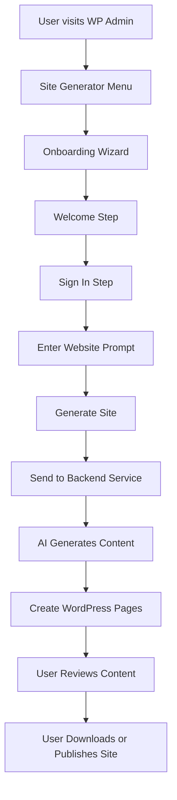
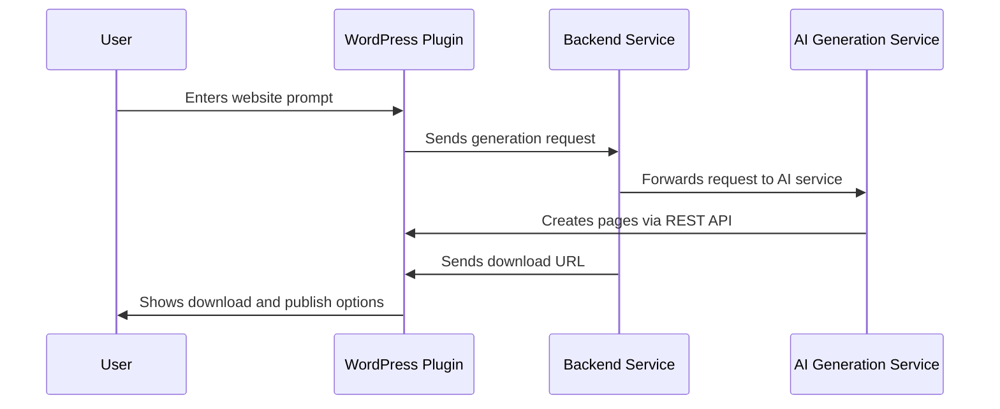

# Obsidian Static Site Generator

## Overview

The "Obsidian Static Site Generator" plugin enables users to generate websites from their WordPress admin panel. It provides a simple interface for creating websites through an AI-powered generation process based on user prompts.

---

## User Flow Diagram



---

## User Input Collection

The plugin collects the following information from users:

1. **Website Prompt**
   - User's website idea/prompt (max 200 characters)
   - Can be entered manually or selected from example options:
     - Fashion Website
     - Dental Website
     - Photographer Portfolio

2. **Authentication Details**
   - Email Address
   - Password
   - Option to sign up for new users

All collected information is used to generate a website that matches the user's requirements.

---

## Technical Deep-Dive

### System Architecture

The system consists of three main components that work together:

1. **WordPress Plugin**
   - Provides user interface and collects input
   - Manages WordPress pages and content
   - Exposes REST API endpoints
   - Handles user authentication
   - Communicates with backend service

2. **Backend Service**
   - Receives generation requests
   - Processes and validates data
   - Manages file storage and delivery
   - Handles authentication and security

3. **AI Generation Service**
   - Receives site requirements
   - Generates appropriate content
   - Creates WordPress pages via REST API
   - Manages content structure and formatting

### Component Interaction Flow



### Integration Points

1. **REST API Endpoints** (WordPress Plugin)
   ```php
   /wp-json/obsidian/v1/page          // Create page
   /wp-json/obsidian/v1/page/{id}     // Update page
   /wp-json/obsidian/v1/page/{id}     // Delete page
   /wp-json/obsidian/v1/pages         // List pages
   ```

2. **Backend Service API**
   ```
   POST /generate     // Start site generation
   GET  /download/{id} // Download generated site
   ```

3. **Authentication**
   - WordPress Plugin uses API token for backend communication
   - API endpoints are protected by WordPress nonces
   - Backend service uses Bearer token authentication
   - User capabilities are checked for all operations

## Plugin Flow

1. **Onboarding Wizard**  
   - The plugin starts with an onboarding wizard accessible via the WordPress admin dashboard under "Obsidian Generator."  
   - The wizard guides users through the following steps:  
     - **Welcome**: Introduces the plugin.  
     - **Sign In/Sign Up**: Authenticates the user.  
     - **Website Prompt**: Users describe their website using a text input with character counter and example options.  
     - **Site Generation**: Users submit their prompt to generate the site.

2. **Admin UI**  
   - The admin UI (`includes/admin-ui.php`) renders the onboarding wizard and API documentation.  
   - It uses a modern, responsive design.  
   - The UI includes a form for entering the website prompt.

## Key Files and Functions

- **`obsidian-static-generator.php`**: Main plugin file. Registers REST API endpoints and AJAX handlers.
- **`includes/admin-ui.php`**: Renders the admin UI and API documentation.
- **`includes/onboarding.php`**: Manages the onboarding wizard flow.

## Developer Notes for AI Agent Integration

1. **API Endpoints**  
   - Use the REST API endpoints to programmatically create, edit, delete, and list pages.  
   - Ensure the AI agent sends valid JSON payloads as shown in the API documentation.

2. **Authentication**  
   - Currently, authentication is disabled. If re-enabled, the AI agent must include a valid Bearer token in the `Authorization` header.  
   - Example: `Authorization: Bearer <your-token>`

3. **Error Handling**  
   - The API returns standard HTTP status codes and JSON responses.  
   - Handle errors gracefully (e.g., 500 for server errors, 400 for invalid inputs).  
   - If the obsidianbackend fails to communicate with the AI agent, a 500 error will be returned with a message indicating the failure.

4. **Customization Options**  
   - Users can select customization options during the onboarding process, including templates, color schemes, and content tone.  
   - These options are passed to the obsidianbackend when generating the site.  
   - Example payload for generating a site:  
     ```json
     {
       "site_idea": "A modern fashion website for a boutique store",
       "template": "modern",
       "color_scheme": "light",
       "content_tone": "professional"
     }
     ```

5. **Logs & Debugging**  
   - The plugin includes a logs section in the admin UI for debugging and regeneration.  
   - If site generation fails, check the logs for detailed error messages.  
   - Use the "Regenerate Site" button to retry site generation if needed.

6. **Testing**  
   - Test the endpoints using tools like Postman or curl to ensure they work as expected.  
   - Verify the generated pages in the WordPress admin dashboard.

7. **Future Enhancements**  
   - Consider re-enabling authentication for security.  
   - Add more endpoints or features as needed (e.g., custom templates, SEO settings). 
